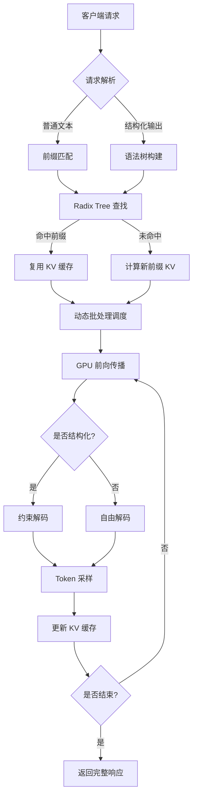

# SGLang：面向大模型服务的高性能推理引擎技术解析

## 1. SGLang 是什么？

**SGLang**（Structured Generation Language）是一个专为大语言模型（LLM）推理服务设计的高性能运行时系统。它由 UC Berkeley 团队开发，旨在解决传统 LLM 服务框架在处理复杂推理任务（如多轮对话、代码生成、结构化输出）时存在的效率瓶颈。

SGLang 的核心创新在于将**语言模型推理**与**程序逻辑**解耦，通过引入一种轻量级的 DSL（领域特定语言）来描述推理流程，并在底层运行时中实现了对**前缀共享**、**结构化约束**和**动态调度**的深度优化。

> **注意**：SGLang 并非一个独立的“语言”，而是一个**推理运行时 + 编程接口**的组合体。它允许开发者用 Python 编写类似“模板”的逻辑，而运行时负责高效执行这些逻辑。

---

## 2. 试图解决的核心问题

传统 LLM 服务框架（如早期 vLLM、Hugging Face Transformers）主要关注**吞吐量**和**内存效率**，但在以下场景中表现不佳：

| 问题 | 传统框架的痛点 | SGLang 的解决方案 |
|------|----------------|-------------------|
| **前缀重复计算** | 多轮对话或批量请求中，相同前缀（如系统提示、上下文）被重复编码，浪费 GPU 算力。 | **RadixAttention**：自动识别并共享前缀 KV 缓存，避免重复计算。 |
| **结构化输出低效** | 生成 JSON、XML 或特定格式时，需依赖外部验证器或多次重试，导致延迟高、失败率高。 | **结构化生成**：在解码阶段直接约束 token 选择，确保输出符合语法树，无需后处理。 |
| **复杂推理流程难编排** | 多步推理（如“先思考再回答”、“并行调用多个工具”）需手动拼接 prompt，难以优化。 | **SGLang DSL**：用代码描述推理流程，运行时自动优化执行路径。 |
| **动态负载调度** | 静态批处理无法适应请求长度和复杂度的动态变化。 | **动态调度器**：根据请求特征实时调整批大小和并行策略。 |

---

## 3. 核心组件协同机制

SGLang 的性能优势源于其运行时、缓存、生成和调度四大组件的紧密协同：

### 3.1 运行时（Runtime）
- **轻量级进程模型**：每个推理请求由一个轻量级协程（coroutine）处理，避免线程切换开销。
- **异步 I/O**：支持非阻塞的 GPU 通信和 CPU-GPU 数据拷贝。
- **内存池管理**：预分配 KV 缓存内存池，避免运行时内存碎片。

### 3.2 前缀缓存 / RadixAttention
- **Radix Tree 结构**：将 KV 缓存组织为基数树（Radix Tree），每个节点代表一个 token 序列的前缀。
- **自动前缀匹配**：新请求到达时，运行时自动在树中查找最长匹配前缀，直接复用已计算的 KV 缓存。
- **LRU 淘汰策略**：当缓存满时，按最近最少使用原则淘汰节点，确保高频前缀常驻内存。
- **跨请求共享**：不同请求若共享前缀（如相同系统提示），可共享同一 KV 缓存节点，显著降低显存占用和计算量。

### 3.3 结构化生成（Structured Generation）
- **语法树约束**：用户可定义 JSON Schema、正则表达式或自定义文法。
- **解码时约束**：在每一步 token 采样时，运行时仅允许符合语法树的 token 被选择，确保输出 100% 符合格式。
- **零后处理**：无需外部验证器或重试，直接生成合法结构化数据。
- **性能优势**：相比“生成+验证+重试”模式，延迟降低 30-50%（具体取决于结构复杂度），且无失败风险。

### 3.4 调度与并行
- **动态批处理（Dynamic Batching）**：根据请求长度和剩余 token 数动态调整批大小，最大化 GPU 利用率。
- **张量并行（Tensor Parallelism）**：支持多 GPU 并行计算，自动切分模型权重。
- **流水线并行（Pipeline Parallelism）**：对于超大模型，支持跨 GPU 的流水线并行。
- **请求级并行**：不同请求可并行执行，共享前缀缓存和 GPU 资源。

---

## 4. 端到端流程：从请求到 Token 返回

以下是一个典型请求在 SGLang 中的处理流程：

### 详细步骤：
1. **请求接收**：HTTP/gRPC 请求到达，解析 prompt 和参数（如 `temperature`、`max_tokens`、`json_schema`）。
2. **前缀匹配**：
   - 运行时将 prompt 分词，并在 Radix Tree 中查找最长匹配前缀。
   - 若命中，直接加载对应 KV 缓存；否则，计算新前缀的 KV 并插入树中。
3. **批处理调度**：
   - 调度器根据当前 GPU 负载、请求长度和剩余 token 数，决定将请求加入哪个批次。
   - 若启用张量并行，请求被分发到多个 GPU 分片。
4. **前向传播**：
   - GPU 执行 Transformer 前向计算，生成下一个 token 的 logits。
   - 若为结构化生成，logits 被语法树约束，仅允许合法 token。
5. **Token 采样**：
   - 根据采样策略（greedy、top-k、top-p）选择 token。
   - 更新 KV 缓存，将新 token 追加到 Radix Tree。
6. **循环**：重复步骤 4-5，直到生成结束符或达到 `max_tokens`。
7.