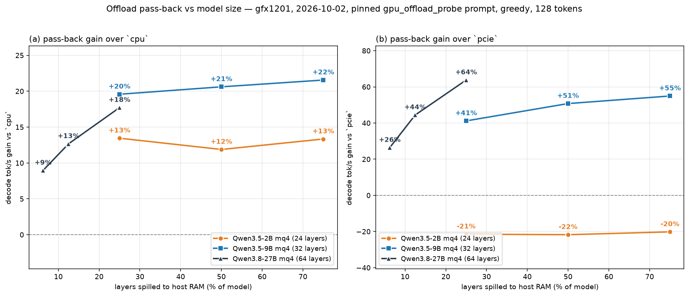

# Offload pass-back: cross-model spread (2B / 9B / 27B) — gfx1201 — 2026-10-02

**Lifecycle:** `historical`

**Disposition:** the multi-model end-to-end `memory.offload_exec` A/B — the
answer to "how does pass-back pay as the model changes?". It supersedes the
9B-only headline in
[`2026-10-01-offload-passback-split-gfx1201.md`](2026-10-01-offload-passback-split-gfx1201.md)
§ 1 / § 8.1 and
[`2026-10-02-offload-passback-mode-ab-gfx1201.md`](2026-10-02-offload-passback-mode-ab-gfx1201.md)
for current-HEAD figures; both older records stand under their own fixtures. It is
not a baseline, not an admission, and not a
[`docs/BENCHMARKS.md`](../BENCHMARKS.md) claim.

## Fixture (measured)

- Host: 1 × Radeon RX 9070 XT `gfx1201`, PCIe 4.0 ×16, HIP 7.2; Ryzen 7 7800X3D,
  16 cores. **Load uncontrolled** (per-model 1-min load in the table below).
- Source HEAD `a7e3e1c33a58ccdee0ebb73f28f76c200d084947`;
  `target/release/daemon` md5 `b35c25f032f80882d757512d0f8ee98a`;
  `target/release/hipfire` md5 `ee24d2671dc3480ac8949a43df71b156`.
- Prompt `benchmarks/prompts/gpu_offload_probe.txt`, md5
  `5835c71e471849b4a72e1dc8e39695e7` (59 tokens) for every model.
- `--spec off --backend noslots --workload stateless`, greedy, 128 tokens,
  one fresh process per run (`pkill daemon` before each).

| model | file | md5 | layers |
|---|---|---|---|
| Qwen3.5-2B mq4 | `qwen3.5-2b.mq4` | `9ed6628f2df83ef4b1c062afd4a85bfb` | 24 |
| Qwen3.5-9B mq4 | `qwen3.5-9b.mq4` | `296092bf1e6a45d78c1acf815eb93366` | 32 |
| Qwen3.8-27B mq4 | `qwen3.8-27b.mq4` | `d1292b4d5bd6046693604201a6ca8074` | 64 |

## Method

`cpu` / `passback` (`share auto`) / `pcie`, on a **spill-fraction** grid so the
models share one axis: 2B and 9B at 25 / 50 / 75 % of layers spilled, 27B at
12.5 / 25 % (the "smaller spread"). **Arm order rotates by round** (`round % 3`)
so no arm owns the post-kill cold slot; 5 rounds per point for 2B and 9B, 3 for
27B. Rows are committed with the figure under
`data-2026-10-02-offload-passback-model-spread/`.

## Result (measured) — median decode tok/s

| model | spilled | % | `cpu` | `passback` | `pcie` | passback vs cpu | passback vs pcie | pcie vs cpu |
|---|---:|---:|---:|---:|---:|---:|---:|---:|
| 2B | 6 / 24 | 25.0 | 69.90 | 79.30 | **101.00** | +13.4 % | **−21.5 %** | **+44.5 %** |
| 2B | 12 / 24 | 50.0 | 42.10 | 47.10 | **60.20** | +11.9 % | **−21.8 %** | **+43.0 %** |
| 2B | 18 / 24 | 75.0 | 30.00 | 34.00 | **42.60** | +13.3 % | **−20.2 %** | **+42.0 %** |
| 9B | 8 / 32 | 25.0 | 28.10 | **33.60** | 23.80 | **+19.6 %** | +41.2 % | −15.3 % |
| 9B | 16 / 32 | 50.0 | 16.50 | **19.90** | 13.20 | **+20.6 %** | +50.8 % | −20.0 % |
| 9B | 24 / 32 | 75.0 | 11.60 | **14.10** | 9.10 | **+21.6 %** | +54.9 % | −21.6 % |
| 27B | 8 / 64 | 12.5 | 15.00 | **16.90** | 11.70 | **+12.7 %** | +44.4 % | −22.0 % |
| 27B | 16 / 64 | 25.0 | 9.60 | **11.30** | 6.90 | **+17.7 %** | +63.8 % | −28.1 % |

Every passback−cpu paired round is positive: **5/5** at each 2B and 9B point,
**3/3** at each 27B point (paired per-round medians +13.3 %, +11.7 %, +13.3 %,
+19.5 %, +20.7 %, +21.7 %, +13.3 %, +17.7 %), so the deltas are not a median
artifact. Spreads are tight except passback on the 9B (`[33.0–33.8]` etc.).

Per-model load (1-min, start → end): 2B 7.31 → 5.24; 9B 2.40 → 7.31; 27B 4.45 →
6.58. Absolutes are contended-host numbers; the interleaved **relative** deltas
are the readable part.

## Reading

1. **The 9B is the regime the mode was built for.** passback beats `cpu` by
   +19.6 / +20.6 / +21.6 % across 25–75 % spilled, and the gain rises with the
   spill; `pcie` is the clear loser (−15 to −22 % vs `cpu`). Every passback−cpu
   pair 5/5 positive.
2. **On the 2B, pass-back is the *wrong* mode: `pcie` beats it at every spill
   fraction.** `pcie` (the GPU reading the host-mapped weights over the link) is
   **+42 to +45 % over `cpu`**, while pass-back is only +12 to +13 %, i.e.
   **~20 % *behind* `pcie`**. The mechanism is the `SHARE_MAX = 0.50` cap
   (`crates/hipfire-dispatch/src/offload_split.rs`): the 2B's whole-model rates put
   the balance point at `r_gpu/(r_gpu+r_cpu) ≈ 1.44/2.44 ≈ 0.59` for the spilled
   steps, *above* the cap, so the scheduler is forced to keep ≥50 % of the rows on
   the slower CPU arm and can never collapse to the GPU-only route. On the 9B
   (`pcie`/`cpu` = 0.78–0.85) and 27B (0.72–0.78) the balance point is 0.42–0.46,
   under the cap, so it does not bind. **Actionable:** a small model should use
   `memory.offload_exec=pcie`, not `passback`; to make pass-back cover it, the
   share would have to be allowed to reach 1 (a GPU-only degenerate point), which
   the current clamp forbids.
3. **A bigger model does *not* show a bigger pass-back gain** — the opposite of
   the intuition that motivated the 27B point. At the shared 25 % spill fraction
   the 9B gains +19.6 % and the 27B +17.7 %, and the 27B's 12.5 % point is
   +12.7 %, *below* every 9B point. The gain is a ratio of the two engines' rates,
   which is roughly model-size-independent; what the model size changes is which
   route wins (see 2).
4. **The gain over `cpu` rises with the spill fraction** where the balance point is
   under the cap (9B 19.6 → 21.6 %; 27B 12.7 → 17.7 %; 2B flat ~12–13 %, since its
   cap-bound split is pinned near 0.5 regardless).

## Not measured / out of scope

- **One host, one prompt, 128 tokens, greedy, `noslots`/`stateless`.** Load
  uncontrolled; a quiet-host re-run would move the absolutes.
- **Correctness is not re-tested here.** The 2026-10-01 record established
  bit-identity for the 9B split; the 2B and 27B splits were smoke-loaded
  (pass-back reports all spilled layers splittable/covered) but their token
  streams were not compared against `cpu`/`pcie`.
- **The `SHARE_MAX` cap is diagnosed, not changed.** Raising or removing the 0.5
  ceiling (to let a pass-back collapse to GPU-only) is the fix that would cover
  small models; it is not attempted here.
- **Other arches, quants, serve/slots, long context, prefill, spec decode, MoE** —
  untouched.
