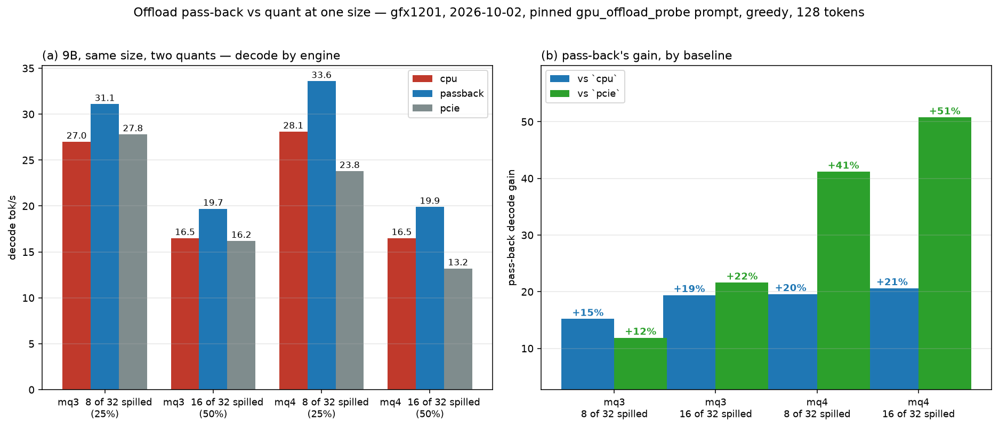

# Amendment 1 — pass-back quant spread — 2026-10-02

**Lifecycle:** `historical`

**Amends (does not modify):**
[`2026-10-02-offload-passback-quant-spread-gfx1201.md`](2026-10-02-offload-passback-quant-spread-gfx1201.md),
per [`README.md`](README.md).

## Adds the figure

The record's numbers are plotted (no measured number changes):

`data-2026-10-02-offload-passback-quant-spread/quant-chart.py` renders it from
the committed jsonl — `9b_mq3.jsonl` here and `sp_9b.jsonl` from the sibling
model-spread data dir (mq4).

- **Panel (a)** — decode tok/s by engine for mq3 vs mq4 at 8/32 and 16/32 spilled.
- **Panel (b)** — pass-back's gain over `cpu` and over `pcie`. It shows the two
  findings directly: on **mq3 `pcie` is ≈`cpu`**, so pass-back's gain over `pcie`
  is modest (+12 %/+22 %), while on **mq4 `pcie` is far behind** (+41 %/+51 %);
  and pass-back's own gain over `cpu` is **lower on mq3** (+15 %/+19 %) than on
  mq4 (+20 %/+21 %).
