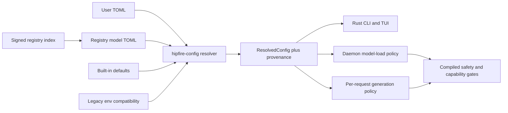

# Rust control plane and registry-packaged TOML configuration

**Status:** Draft specification
**Date:** 2026-07-20
**Target:** hipfire 0.3.x transition; no compatibility break in the first shipping phase
**Owners:** `hipfire-config`, `hipfire-registry`, `hipfire-cli`, runtime load/request policy

## 1. Decision

Hipfire's shipped operator surface will converge on one Rust control plane. The
`hipfire` CLI, daemon, TUI, model registry, configuration resolver, and runtime
policy will consume shared Rust types.

The official model registry may package versioned `.toml` manifests containing
typed model metadata, artifact declarations, and recommended configuration.
Registry manifests are a defaults layer, not executable code and not an escape
from engine safety checks.

Python remains supported for developer automation, measurement, corpus work,
quantization research, and release tooling. Python tools consume stable JSON,
JSONL, HTTP, or subprocess interfaces; they do not independently implement
product defaults or runtime admission policy.

The intended product shape is:

> One Rust product, with Python as the laboratory.

## 2. Why this is needed

The current product path has multiple semantic owners:

- `cli/index.ts` owns the user configuration shape, defaults, validation,
  per-model overlays, registry recommendations, daemon lifecycle, and request
  construction.
- `cli/registry_loader.ts` owns the dynamic registry schema and fallback chain.
- `scripts/registry_gen.py` repeats registry enums, bounds, and validation.
- `crates/hipfire-runtime/src/config.rs` and
  `crates/rdna-compute/src/feature_flags.rs` independently translate environment
  variables into Rust state.
- `crates/hipfire-tui` repeats configuration and registry structures, then
  shells out to `bun cli/index.ts` for product actions.

This creates an environment-variable protocol between the TypeScript control
plane and the Rust runtime. It also allows defaults and validation rules to
drift between the CLI, registry generator, TUI, daemon, and documentation.

A Rust-owned schema changes the path to:



Environment variables stop being the transport between two product
implementations. They become a small, explicit compatibility and diagnostic
surface applied by the same resolver.

## 3. Goals

1. One typed schema for CLI, TUI, daemon, registry, and tests.
2. Human-readable global, per-model, and registry configuration using TOML.
3. Deterministic resolution with field-level provenance.
4. Registry-packaged model recommendations without granting the registry power
   to bypass compiled safety or compatibility checks.
5. Offline behavior at least as reliable as the current bundled-registry
   fallback.
6. A migration path that preserves current `config.json`, `models.json`, and
   `registry/v1.json` behavior until parity is demonstrated.
7. Stable machine interfaces so Python and shell automation do not need to
   parse human CLI output or duplicate the configuration schema.
8. A single distributable `hipfire` executable without a required Bun runtime.

## 4. Non-goals

- TOML will not describe kernel launch signatures, `DType` arithmetic,
  allocation layouts, model forward implementations, or executable dispatch
  code.
- Registry data will not force an unsupported kernel, disable a safety refusal,
  admit an uncertified Redline route, or alter weight-format semantics.
- Configuration is not required to be hot-reloadable. Each field declares
  whether it is process-, model-load-, session-, or request-scoped.
- The first implementation will not provide a general expression language for
  architecture predicates.
- Python research code does not need to be rewritten in Rust merely to make the
  shipped product Rust-only.
- The transition will not be a big-bang rewrite of all CLI commands.

## 5. Terminology

| Term | Meaning |
|---|---|
| Built-in default | Value compiled into `hipfire-config`; always available offline. |
| Registry default | Recommended value in an authenticated registry model manifest. |
| Target default | Registry recommendation scoped to an exact architecture or architecture family. |
| Global override | User value in `~/.hipfire/config.toml`. |
| Per-model override | Sparse user value for one local model identity or registry tag. |
| One-shot override | Explicit CLI/request value for one command, load, or generation. |
| Safety gate | Compiled validation/refusal that runs after configuration resolution and cannot be weakened by registry data. |
| Provenance | The source selected for a resolved value, plus the lower-priority candidates it shadowed. |
| Registry package | Signed index plus hash-pinned TOML manifests shipped remotely and embedded as an offline fallback. |

## 6. Crate ownership

The implementation should introduce or converge on these Rust crates/modules.
Names are normative unless implementation pressure justifies combining the
first two.

### 6.1 `hipfire-config`

Owns:

- `Config`, `PartialConfig`, and nested typed sections.
- Defaults, validation, enums, range checks, and migrations.
- Global and per-model user TOML loading.
- Legacy JSON import.
- Legacy environment compatibility.
- Resolution and field-level provenance.
- Serialization for config inspection and daemon requests.

This crate must not depend on GPU or model implementation crates.

### 6.2 `hipfire-registry`

Owns:

- Registry index and model-manifest types.
- Signature and SHA-256 verification.
- Bundled, cached, network, and stale-cache fallback.
- Registry model/alias resolution.
- Artifact and sidecar declarations.
- Conversion of manifest defaults into `hipfire_config::PartialConfig`.

It depends on `hipfire-config`, not the reverse.

### 6.3 `hipfire-client`

Owns:

- Daemon HTTP/OpenAI request and response types.
- Streaming and health/status clients.
- Shared model-load and generation request types.

### 6.4 `hipfire-cli`

Owns the shipped `hipfire` binary and uses the three libraries above for
`config`, `registry`, `pull`, `list`, `run`, `chat`, `serve`, `stop`, `restart`,
`diag`, and other product commands.

`hipfire-tui` links these crates directly. It must not shell out to TypeScript
or carry a second default map.

## 7. Configuration schema

The user and registry schemas share typed configuration sections, but registry
manifests receive only an allowlisted subset.

The initial section layout is:

```toml
[generation]
temperature = 1.0
top_p = 0.95
top_k = 20
min_p = 0.0
presence_penalty = 1.5
repeat_penalty = 1.05
max_tokens = 4096

[reasoning]
mode = "on"
budget = "med"
max_tokens = 2048
max_total_tokens = 0

[memory]
max_seq = 32768
kv_cache = "q8"
kv_adaptive = "off"

[attention]
flash = "auto"

[speculation]
mode = "auto"
dflash = "off"
mtp = "auto"
mtp_k = 3
ddtree_budget = 0
ddtree_topk = 4

[replay]
backend = "auto"

[fusions]
policy = "safe"

[prompt]
normalize = true

[serve]
host = "0.0.0.0"
port = 11435
idle_timeout_seconds = 300
max_queue = 64
queue_timeout_ms = 30000
```

The exact field inventory will be derived from current `HipfireConfig` and
`RuntimeConfig` during implementation. The nesting above is the stable public
organization; Rust field names may differ internally.

### 7.1 Field metadata

Every public field carries static metadata:

```rust
pub struct ConfigFieldMeta {
    pub key: &'static str,
    pub category: ConfigCategory,
    pub scope: ConfigScope,
    pub registry_allowed: bool,
    pub sensitive: bool,
    pub experimental: bool,
    pub env_compat: Option<&'static str>,
    pub help: &'static str,
}
```

`ConfigScope` is one of:

- `Process`: requires daemon restart.
- `ModelLoad`: resolved when loading or swapping a model.
- `Session`: fixed for a conversation/session unless explicitly replaced.
- `Request`: may vary per generation request.
- `Diagnostic`: developer-only and excluded from registry manifests.

The CLI and TUI generate listings, help text, validation, restart warnings,
and `config explain` output from this metadata. They must not maintain parallel
hardcoded knob tables.

### 7.2 Typed policies, not one key per old environment variable

The migration must consolidate related switches into typed policies. It must
not turn every historical `HIPFIRE_*` name into a permanent TOML key.

Examples:

- Multiple speculation gates become `speculation.mode` plus mechanism-specific
  typed subfields.
- Kernel-fusion environment variables become a small `fusions.policy` surface
  (`safe`, `off`) plus internal compiled eligibility decisions.
- Redline/HIP/backend selection becomes `replay.backend = "auto" | "hip" |
  "redline"`, subject to certification and capability gates.
- Trace dumps, fault injection, and profiler taps remain diagnostic environment
  variables unless they mature into supported product behavior.

Registry manifests may select `safe` or `auto`; they may not force a specific
kernel symbol or unsafe path.

## 8. Registry v2 package layout

The official source tree uses one generated index and one fully materialized
manifest per model tag:

```text
registry/v2/
├── index.toml
├── index.toml.sig
├── SHA256SUMS
└── models/
    ├── qwen3.6/
    │   ├── 35b-a3b-mq4r.toml
    │   └── 27b-mq4.toml
    ├── deepseek/
    │   └── v4-flash.toml
    └── lfm2.5/
        └── 1.2b-mq4.toml
```

The runtime consumes fully expanded model manifests. Authoring tools may use
templates or family profiles, but the generator must materialize inheritance
before publishing. Runtime profile inheritance, arbitrary includes, and remote
include chains are deliberately excluded from v2.

The release binary embeds a known-good copy of the complete package. A dynamic
update replaces it only after the index signature and every referenced manifest
hash validate.

### 8.1 Registry index

Example `registry/v2/index.toml`:

```toml
schema_version = 2
revision = "2026-07-20.1"
generated_at = "2026-07-20T20:00:00Z"
key_id = "hipfire-registry-2026"

[[models]]
tag = "qwen3.6:35b-a3b-mq4r"
manifest = "models/qwen3.6/35b-a3b-mq4r.toml"
sha256 = "0123456789abcdef0123456789abcdef0123456789abcdef0123456789abcdef"
aliases = ["qwen3.6:35b-a3b-redline"]

[[models]]
tag = "qwen3.6:27b"
manifest = "models/qwen3.6/27b-mq4.toml"
sha256 = "abcdef0123456789abcdef0123456789abcdef0123456789abcdef0123456789"
aliases = []
```

Requirements:

- `schema_version` must match exactly. Older binaries reject unknown future
  schemas and keep their bundled registry.
- Tags and aliases are unique after normalization.
- Manifest paths are relative, normalized, and remain below the package root.
- Manifest hashes are mandatory lowercase SHA-256.
- Unknown top-level fields are rejected in published packages.
- The detached signature covers the exact bytes of `index.toml`; manifests are
  transitively authenticated by their index-pinned hashes.
- The signature algorithm is Ed25519. `index.toml.sig` contains the base64
  encoding of the raw 64-byte signature and no additional document structure;
  the signed `key_id` selects one of the public keys embedded in the binary.

### 8.2 Model manifest

Example `models/qwen3.6/35b-a3b-mq4r.toml`:

```toml
schema_version = 1
kind = "model"
tag = "qwen3.6:35b-a3b-mq4r"
family = "qwen3.6"
architecture_id = 6
description = "Qwen3.6 35B-A3B MQ4R speed SKU"

[artifact]
provider = "huggingface"
repository = "schuttdev/hipfire-qwen3.6-35b-a3b"
file = "qwen3.6-35b-a3b.mq4r"
sha256 = "4685c140c46b1a6f31a0fd9053bf09d5faf1d2529d715b84794249b66cde0428"
size_bytes = 18700048128
quant = "mq4r"

[[sidecars]]
kind = "mtp"
file = "qwen3.6-35b-a3b.mtp"
sha256 = "1e11a06d1946e1e5711d6692894e917a61d5f360d4f3508c8372d49e97c912c1"
size_bytes = 466952320
optional = true

[requirements]
minimum_vram_gb = 22.0
supported_arches = [
  "gfx1010", "gfx1030", "gfx1100", "gfx1101", "gfx1102",
  "gfx1150", "gfx1151", "gfx1200", "gfx1201",
]

[defaults.generation]
temperature = 1.0
top_p = 0.95
top_k = 20
min_p = 0.0
presence_penalty = 1.5

[defaults.memory]
kv_cache = "q8"

[defaults.replay]
backend = "auto"

[defaults.fusions]
policy = "safe"

[[targets]]
arches = ["gfx1100"]

[targets.defaults.replay]
backend = "auto"

[[targets]]
arches = ["gfx1151"]

[targets.defaults.replay]
backend = "auto"

[[targets]]
arches = ["gfx1200", "gfx1201"]

[targets.defaults.replay]
backend = "auto"
```

The example intentionally does not name PM4 packets, HSACOs, individual fusion
kernels, or legacy environment variables. `backend = "auto"` asks the compiled
policy to select an admitted route. The engine remains responsible for model,
architecture, topology, artifact, and certification checks.

### 8.3 Conditional target defaults

Registry v2 supports only exact architecture lists:

```toml
[[targets]]
arches = ["gfx1100", "gfx1101"]

[targets.defaults.memory]
kv_cache = "q8"
```

Rules:

- `arches` contains canonical architecture names from the Rust architecture
  registry.
- A manifest may contain at most one matching target block for a concrete GPU.
- Overlapping blocks are a publication error.
- No arbitrary expressions, negation, driver-version comparisons, environment
  tests, or host commands are allowed.
- Multi-GPU/topology-sensitive behavior remains compiled policy in v2.
- Target defaults are recommendations and are still checked by engine safety
  gates.

If future requirements exceed exact architecture selection, a later schema may
add typed predicates. V2 must not grow a string expression evaluator.

## 9. Registry authority and trust boundary

Registry TOML is data from a privileged but fallible source. It may:

- Describe downloadable model and sidecar artifacts.
- Pin file hashes and sizes.
- Declare model identity and expected architecture/quantization metadata.
- Supply allowlisted generation, memory, speculation, prompt, replay, and
  fusion defaults.
- Supply exact-architecture recommendation layers.

It may not:

- Execute scripts, load shared libraries, or interpolate shell/environment
  values.
- Supply absolute local paths.
- Define arbitrary URLs outside typed artifact providers without explicit user
  opt-in.
- Override `host`, `port`, local device selection, log paths, credentials, or
  other machine-owner settings.
- Enable diagnostic/fault-injection fields.
- Select raw kernel symbols, HSACO paths, PM4 payloads, or dispatch tables.
- Disable model-format, architecture, VRAM, topology, correctness, or replay
  certification gates.
- Turn an experimental or refused route into an admitted route.

Rust manifest types use `#[serde(deny_unknown_fields)]`. A malformed model
manifest is rejected as a unit; values are never partially salvaged into a
different semantic configuration.

### 9.1 Integrity and authenticity

Dynamic registry v2 requires:

1. HTTPS transport.
2. Detached signature verification for the exact index bytes using an embedded
   trusted public key identified by `key_id`.
3. SHA-256 verification of each referenced manifest.
4. SHA-256 and size verification of downloaded model artifacts where supplied.
5. Atomic cache installation using a temporary directory, validation, sync,
   and rename.

Hashing without a trusted signed root is integrity checking, not authenticity;
the signature is therefore part of the v2 design rather than a deferred
security claim.

Key rotation uses a release that embeds both the old and new public key before
the registry begins signing exclusively with the new key.

### 9.2 Offline and failure behavior

The fallback chain is:

1. Fresh verified cache.
2. Verified network update.
3. Stale verified cache.
4. Bundled verified registry package.

Network, parse, signature, schema, path, or manifest failures never replace a
known-good cache. The CLI reports the selected source through `hipfire diag`
and `hipfire registry status`.

## 10. User configuration files

The Rust product surface uses:

```text
~/.hipfire/
├── config.toml                 # global sparse overrides
├── models.toml                 # local catalog, aliases, sparse per-model overrides
└── registry/
    ├── active/                 # atomically installed verified v2 package
    └── previous/               # last verified package for rollback
```

### 10.1 Global config

Example `~/.hipfire/config.toml`:

```toml
schema_version = 1

[generation]
max_tokens = 4096

[memory]
kv_cache = "auto"
max_seq = 32768

[serve]
host = "0.0.0.0"
port = 11435
idle_timeout_seconds = 300
```

Only explicit overrides are written. Absent fields continue through the
resolution ladder.

### 10.2 Local catalog and per-model overrides

Example `~/.hipfire/models.toml`:

```toml
schema_version = 1

[aliases]
"my-qwen" = "local:qwen36-a3b"

[models."local:qwen36-a3b"]
path = "/home/user/.hipfire/models/qwen3.6-35b-a3b.mq4r"
registry_tag = "qwen3.6:35b-a3b-mq4r"

[models."local:qwen36-a3b".overrides.memory]
kv_cache = "q8"

[models."local:qwen36-a3b".overrides.reasoning]
budget = "xhigh"
```

The local catalog is user-controlled and may contain absolute local model
paths. Registry manifests may not.

Aliases do not create a second model identity. Resolution records the alias,
canonical local identity, and registry tag so `config explain` can show which
layer supplied a value.

## 11. Resolution and precedence

Safety gates are not a configuration precedence layer. They run after merge
and may reject or narrow the resolved request. No value source can override a
safety gate.

For ordinary values, highest priority wins:

1. Explicit request or CLI one-shot override.
2. Legacy environment compatibility override.
3. Sparse per-model user override.
4. Global user override.
5. Matching registry target default.
6. Registry model default.
7. Built-in default.

This intentionally treats registry values as recommendations below explicit
user configuration. If a model has a correctness-critical requirement, it must
be represented as a typed requirement and validated/refused—not disguised as a
high-precedence default.

### 11.1 Provenance

The resolver retains provenance for every public field:

```rust
pub enum ConfigSource {
    BuiltIn,
    RegistryModel { tag: String, revision: String },
    RegistryTarget { tag: String, arch: String, revision: String },
    GlobalUser { path: PathBuf },
    ModelUser { model_id: String, path: PathBuf },
    LegacyEnv { name: String },
    OneShot { argument: String },
}

pub struct Resolved<T> {
    pub value: T,
    pub source: ConfigSource,
    pub shadowed: Vec<ConfigCandidate<T>>,
}
```

Human output may summarize shadowed candidates; `--json` exposes the complete
machine-readable chain.

Example:

```text
$ hipfire config explain qwen3.6:35b-a3b-mq4r memory.kv_cache
q8
source: per-model override (~/.hipfire/models.toml)
shadowed:
  q8   registry model qwen3.6:35b-a3b-mq4r@2026-07-20.1
  auto built-in
scope: model-load (reload required)
```

### 11.2 Legacy environment variables

Environment compatibility is implemented in one place in `hipfire-config`.
Each supported legacy name maps to a typed field, parser, deprecation state,
and provenance record.

Rules:

- Explicit CLI arguments win over legacy environment variables.
- Recognized compatibility variables are logged by `config explain` and
  `diag`, including the field they override.
- Invalid values are errors, not silent fallbacks.
- Process-global environment values may not mutate after resolver
  initialization.
- Variables that only serve diagnostics, profiling, test injection, or early
  runtime bootstrap may remain environment-only.
- Deprecated compatibility names receive a documented removal release; they
  are not copied indefinitely into the public TOML schema.

## 12. Runtime handoff

The daemon accepts typed resolved policy rather than discovering product
behavior through ambient environment variables.

Model-load requests carry a serialized `ModelLoadConfig` containing only
model-load-scoped fields. Generation requests carry a `GenerationConfig`
containing request/session fields. Process-scoped configuration is supplied
when the daemon starts.

The daemon validates deserialized types again. It does not trust the CLI merely
because both are Rust.

GPU/model code receives compact internal policy structs. It does not parse TOML
or inspect registry manifests in hot paths.

Example internal split:

```rust
pub struct ProcessConfig {
    pub serve: ServeConfig,
    pub devices: DeviceConfig,
}

pub struct ModelLoadConfig {
    pub memory: MemoryConfig,
    pub attention: AttentionConfig,
    pub speculation: SpeculationConfig,
    pub replay: ReplayConfig,
    pub fusions: FusionConfig,
}

pub struct GenerationConfig {
    pub generation: SamplingConfig,
    pub reasoning: ReasoningConfig,
    pub prompt: PromptConfig,
}
```

`FeatureFlags` may remain an internal startup structure, but supported product
fields must enter it from typed configuration rather than direct environment
reads. Internal diagnostic flags remain separate and visibly marked.

## 13. Safety and admission model

Configuration answers “what does the operator or registry prefer?” Compiled
policy answers “is that legal and certified here?”

The order is:

1. Parse and validate every source independently.
2. Resolve values and provenance.
3. Identify the model artifact and actual file metadata.
4. Evaluate architecture, quantization, topology, memory, and route
   capabilities.
5. Apply immutable safety/refusal gates.
6. Produce an `EffectivePolicy` or an actionable refusal.

Examples:

- `replay.backend = "redline"` cannot admit an uncertified model/arch/topology.
- `fusions.policy = "safe"` enables only compiled eligible fusions; the
  registry cannot name or force `gated_norm_mq_rotate`.
- A manifest's `supported_arches` cannot make an incompatible kernel legal.
- A registry VRAM declaration is an early UX gate; real allocation checks are
  still authoritative.
- Redline kernels, PM4 lowering, tapes, HSACOs, and certification hashes remain
  code/artifact policy, not registry-authored configuration.

When a preference is narrowed by safety policy, `config explain --effective`
shows both the requested value and the effective decision with its reason.

## 14. CLI surface

The Rust CLI provides:

```text
hipfire config list [--group <name>] [--json]
hipfire config get <key> [--json]
hipfire config set <key> <value>
hipfire config reset <key>
hipfire config explain [<model>] <key> [--effective] [--json]
hipfire config validate [<path>] [--json]
hipfire config migrate [--dry-run]
hipfire config schema [--json]

hipfire registry status [--json]
hipfire registry update [--force]
hipfire registry verify [<path>] [--json]
hipfire registry show <tag> [--resolved] [--json]
hipfire registry list [--json]
```

`config schema --json` is the stable automation surface for key names, types,
enums, ranges, scopes, defaults, registry eligibility, and deprecation state.

Python tooling should call `hipfire ... --json` or the daemon HTTP API. It
should not import Rust implementation details or reproduce the schema.

## 15. Registry generation and developer tooling

The current Python registry generator may remain during the transition for
Hugging Face discovery and metadata collection, but it is no longer an
independent schema authority.

The desired generation flow is:

```text
Python metadata collector
  -> candidate fully materialized TOML package
  -> Rust `hipfire registry verify`
  -> Rust semantic parity checks
  -> signing step
  -> committed/published package
```

The Python collector may gather repository trees, hashes, sizes, and release
metadata. Rust performs final parsing, enum/range validation, alias integrity,
path validation, semantic checks, and canonical package verification.

CI fails if:

- The package is stale relative to its authored sources.
- A manifest does not deserialize with the current Rust schema.
- An alias is missing or ambiguous.
- An artifact hash/size differs from probed metadata.
- Target blocks overlap.
- Registry defaults contain a field not marked `registry_allowed`.
- Generated documentation or schema fixtures drift.

## 16. Migration from the current stores

Migration is additive and reversible.

### Phase 0: Inventory and golden fixtures

- Freeze representative current resolution cases from `config.json`,
  `models.json`, `registry/v1.json`, CLI flags, and legacy env variables.
- Include aliases, registry recommendations, sampling omission rules, KV
  `auto`, thinking budgets, serve settings, and malformed-input behavior.
- Record expected resolved values and provenance as JSON fixtures.

### Phase 1: `hipfire-config`

- Implement Rust types, metadata, validation, resolution, and provenance.
- Read current JSON stores and the new TOML stores.
- Compare Rust output against the golden current-behavior fixtures.
- Keep the Bun CLI as the outer UX temporarily, but obtain resolution from the
  Rust resolver rather than maintaining two implementations.

### Phase 2: Registry v2

- Generate v2 TOML manifests from the current curated registry.
- Require semantic parity for every v1 tag, alias, artifact, sidecar, and active
  recommendation.
- Embed v2 as the Rust fallback while continuing to publish v1 for older
  clients.
- Add signed dynamic updates and atomic cache rollback.

### Phase 3: Rust CLI and daemon handoff

- Port `config`, `registry`, `list`, `pull`, model discovery, and daemon
  lifecycle first.
- Pass typed model-load and generation configuration to the daemon.
- Port `run`, `chat`, `serve`, and remaining product commands.
- Preserve command names, exit codes, and `--json` shapes where practical.

### Phase 4: TUI convergence

- Replace the TUI's local config/default maps with `hipfire-config`.
- Replace its local registry parser with `hipfire-registry`.
- Replace Bun subprocess calls with direct library calls or the installed Rust
  `hipfire` executable where process isolation is intentional.

### Phase 5: Store migration and Bun removal

`hipfire config migrate`:

1. Reads and validates legacy `config.json`, `models.json`, and folded legacy
   per-model data.
2. Writes TOML to temporary files.
3. Reads the TOML back through the Rust schema.
4. Verifies semantic resolution parity for every local model.
5. Atomically installs the TOML files.
6. Retains timestamped `.json.bak` files.

For at least one compatibility release, JSON remains readable but TOML is the
write target. A later release removes Bun and stops reading legacy JSON only
after migration telemetry and issue reports show the path is safe.

## 17. Compatibility rules

- Existing model files and local paths are not renamed.
- Registry v1 remains published during the compatibility window.
- Existing CLI commands continue to work or receive an explicit migration
  message with a machine-readable replacement.
- Existing environment overrides either map through the compatibility table or
  fail with a named replacement; they are never silently ignored.
- TOML writes preserve comments and ordering where practical using an editing
  representation such as `toml_edit`; runtime deserialization uses typed
  `serde` structures.
- Unknown future schema versions fail closed and retain the last known-good
  registry/config.

## 18. Test requirements

### 18.1 No-GPU tests

- TOML parse/serialize fixtures for every public section.
- `deny_unknown_fields` coverage.
- Bounds, enums, path normalization, and duplicate-key failures.
- Resolution precedence across all seven value layers.
- Provenance and shadowed-candidate output.
- JSON-to-TOML migration parity.
- Registry v1-to-v2 semantic parity.
- Signature and hash success/failure.
- Cache freshness, stale fallback, atomic replacement, and rollback.
- Alias loops, missing tags, path traversal, oversized manifests, duplicate
  tags, and overlapping target blocks.
- Registry rejection of process-local, diagnostic, kernel-symbol, and unsafe
  fields.
- CLI JSON contract snapshots.

### 18.2 Runtime integration tests

- CLI and daemon agree on serialized process/model/request schemas.
- Per-model values remain isolated across model swaps in one daemon.
- A process-global legacy env override is visible in provenance and does not
  mutate unexpectedly after initialization.
- Registry recommendations affect only allowlisted fields.
- Safety gates override/refuse incompatible preferences with a stable reason
  code.

### 18.3 GPU acceptance

Configuration migration itself must not alter kernel code or dispatch. Before
removing the old path, run the existing route-appropriate validation gates on
the supported architecture matrix and compare the effective configuration for
each run. Any performance change requires separate evidence and cannot be
attributed to a serialization-only migration.

For Redline routes, `docs/REDLINE.md` and `docs/VALIDATION.md` remain the
authoritative procedure. Registry defaults do not constitute retained-replay
admission or performance proof.

## 19. Observability

The daemon startup/load log records:

- Config schema version.
- Registry revision and source (`fresh-cache`, `network`, `stale-cache`, or
  `bundled`).
- Canonical model identity and manifest hash.
- Non-default effective policy summary.
- Legacy environment overrides in effect.
- Any preference narrowed by a safety gate, with stable reason code.

Secrets and full prompts are never emitted through configuration provenance.
Sensitive fields are redacted according to field metadata.

`/health` or a dedicated introspection endpoint may expose the registry
revision and a hash of the effective non-sensitive configuration. It must not
expose local credentials or arbitrary filesystem paths.

## 20. Acceptance criteria

The Rust/TOML control plane is ready to become the default when all of the
following are true:

1. One Rust schema generates CLI validation, TUI knob metadata, registry
   validation, and daemon request types.
2. Every current active registry tag and alias has a semantically equivalent v2
   manifest.
3. Current JSON configurations migrate without losing per-model overrides or
   changing resolved behavior, except for separately approved precedence fixes.
4. `hipfire config explain` identifies the source and scope of every supported
   public key.
5. The TUI no longer duplicates defaults or shells out to Bun.
6. A fresh install can run `hipfire pull`, `hipfire serve`, `hipfire run`, and
   `hipfire config` without Bun, Node, or TypeScript files.
7. Python automation can perform all supported scripted operations through
   `--json`, JSONL, or HTTP contracts.
8. Registry corruption, signature failure, or network failure demonstrably
   falls back to a known-good package.
9. Compiled safety gates remain authoritative and have negative tests proving
   registry data cannot bypass them.
10. Route-appropriate correctness and multi-turn validation show no behavior
    drift from the pre-migration product path.

## 21. Deferred questions

These are intentionally deferred until the typed v2 foundation exists:

- Whether registry packages should be transported as individual files or one
  compressed archive. The logical signed-index/hash-pinned-manifest contract is
  the same either way.
- Whether third-party registries receive a general trust-store UI or require an
  explicit `--registry-key`/configuration entry initially.
- Whether local model directories may carry an unsigned convenience manifest.
  If supported, it must be explicitly local-user-controlled and must not inherit
  official-registry trust.
- Whether some architecture recommendation blocks should be generated from
  certification bundles. Certification evidence must remain separate from the
  recommendation manifest even if generation is automated.

## 22. Final architectural rule

TOML describes identity, artifacts, user intent, and recommendations. Rust code
defines semantics, capabilities, and safety.

Any proposed registry field that would require the runtime to interpret a
kernel name, execute code, weaken a refusal, or recreate a feature-flag maze is
out of scope for the configuration schema and belongs in compiled policy.
