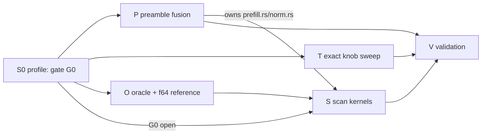

# gfx1201 GDN: measure the split, fuse the preamble exactly, and only then consider a chunk-parallel scan

Date: 2026-09-18. Worktree `/home/kaden/ClaudeCode/warpfront/wt-lloyd`, HEAD `684f6de45`. **Plan only.**
No GPU run, build, dispatch, formatter, linter, or project-wide test was executed for this document. The
only executed work is CPU algebra and resource arithmetic
(`.codeinsight+research/scratch-2026-09-17/GdnPlan/cpu_plan_check.py`, output
`GdnPlan/cpu-plan-evidence.json`, source digests `GdnPlan/source-manifest.json`). Every throughput and
per-kernel-time number attributed to gfx1201 below is **unmeasured**; the only measured per-kernel GDN
evidence in tree is Halo/gfx1151. Reviewers own the final veto (`docs/VALIDATION.md:24-39,255-261`).

Short-file citation key: `prefill.rs` = `crates/hipfire-arch-qwen35/src/qwen35/prefill.rs`; `batch.rs`,
`weights.rs`, `forward.rs`, `config.rs`, `ep_batch.rs` = siblings in that directory; `norm.rs`,
`kernels.rs`, `feature_flags.rs`, `profile.rs`, `arch_caps.rs` = `crates/rdna-compute/src/`;
`fast.hip` = `kernels/src/gated_delta_net_q8_fast.hip`; `f32chunk.hip` =
`kernels/src/gated_delta_net_f32_chunked.hip`; `conv.hip` = `kernels/src/conv1d_silu_split.hip`;
`qknorm.hip` = `kernels/src/fused_qk_l2_norm_scale_interleave_f32_batched.hip`; `sag.hip` =
`kernels/src/fused_sigmoid_alpha_gate.hip`; `gdnpre.hip` = `kernels/src/dflash_gdn_pre.gfx1100.hip`;
`cqn.hip` = `kernels/src/conv1d_silu_split_qknorm.gfx1201.hip`; `parity.rs` =
`crates/rdna-compute/examples/gdn_chunk_parity.rs`; `halo-profile` =
`.codeinsight+research/profiles-2026-09-17/halo-pp8192-profile_prefill-noawq-vs-awq.txt`.

## 0. Verdict

| Question | Verdict |
|---|---|
| Q2 exactness | **A chunk-parallel scan can never be bit-identical at the 512 boundary.** Direct f32 witness below. md5 admission is therefore impossible for the scan; it is **KLD-gated** and ships default-OFF. The *cadence/format/ownership* half of the certified contract (one Q8+EF commit per 512 rows, same buffers, same epilogue arithmetic, same frame reservation count) **is** preserved exactly, which is what the prefix cache, chunk widening and spec rollback actually depend on. |
| Q3 chunk size | **C=32** primary (matches the proven algebra and `CS_MAX`, `f32chunk.hip:50`), bounded sweep {16,32,64}; the chunk axis is looped **on-device inside one workgroup per head-half**, not host-serialized. |
| Q3 WMMA | **Not in v1.** The state products (`W·Sᵀ`, `Q·Sᵀ`, rank-C carry) are 83 % of the MACs and must stay f32; only the two C×C Grams (7 %) are WMMA-eligible without touching state precision. f16 WMMA there is worth 5-15 % of the scan's own time — a measured stage 2, not a v1 dependency. |
| Q3 expected time | Derived **≈190-410 µs** per 512-row segment per LA layer (floor ≈150 µs) against a *measured-unknown* serial time (Halo: 990.77 µs). Break-even ≈400 µs. |
| Q4 preamble | Today **3 launches** fuse to **1**, byte-exact; separately the conv kernel's 512-long per-channel dependent chain is removable **exactly**. This is the strongest md5-exact lever in the document and does not depend on the scan. |
| Q5 decode | **Strictly separate, no transfer.** C=1 degenerates to the serial recurrence; the only decode obligation is a *negative* one (don't touch the shared source, hold the 36.4 floor). |
| Slice order | **S0 profile → {P preamble, T exact tuning, O oracle} in parallel → S scan iff S0's gate opens → V validation.** |

The single largest risk this plan guards against: **writing a scan kernel that is slower than the kernel
it replaces.** On Halo the incumbent uses ≈19 % of f32 VALU peak and ≈21 % of DRAM peak (§1.2), so
headroom exists in principle — but the chunk reformulation does *more* f32 work than the serial
recurrence, not less (§3.1). Whether headroom survives that on gfx1201 is a measurement nobody has
taken. S0 takes it first.

## 1. Slice 0 — the gfx1201 per-kernel split (Q1)

### 1.1 Vehicle, command, and what it does and does not prove

`crates/saddle-lab/examples/profile_prefill_qwen35.rs` wraps exactly one `forward_prefill_batch` in
`profile::start/stop` and aggregates per `(category, kernel)` (`:154-177,186-200`). It takes
`--prefill N --warmup N --kv-mode asym3|q8` (`:41-71`), builds its own `DeltaNetState` and a
`Qwen35Scratch::new(..., 128)` (`:120-121`), and resets DN state before the profiled pass (`:155`).

```sh
R=/home/kaden/ClaudeCode/warpfront/wt-lloyd/.codeinsight+research/scratch-2026-09-17/GdnPlan
MODEL=/srv/hw-gate/models/qwen3.8-27b.mq4-xt
mkdir -p "$R/slice0"
bash scripts/check_fixture.sh --sha "$MODEL"
cargo build --release -p saddle-lab --example profile_prefill_qwen35 --features deltanet
for PP in 512 8192; do for ARM in base fp8v2 iu4; do
  env HOME=/home/kaden/.hipfire-homes/ab0 ROCR_VISIBLE_DEVICES=0 \
      HIPFIRE_GRAPH=0 HIPFIRE_NORMALIZE_PROMPT=0 HIPFIRE_LLOYD_GFX12=1 \
      HIPFIRE_KERNEL_CACHE="$R/slice0/cache" \
      $( [ $ARM = fp8v2 ] && echo HIPFIRE_GFX12_MQ4V2_FP8_V2=1 ) \
      $( [ $ARM = iu4 ]   && echo HIPFIRE_GFX11_MQ4V2_IU4=1 ) \
    ./target/release/examples/profile_prefill_qwen35 "$MODEL" \
      --prefill $PP --warmup 1 --kv-mode q8 \
      > "$R/slice0/$ARM-pp$PP.txt" 2>&1
done; done
```

Eager only (`HIPFIRE_GRAPH=0`) — the profiler records on the null stream. Three arms because the
non-GEMM share is a *fraction of a moving denominator*: the iu4 v2 and fp8 v2 routes are 1.4×/1.1× the
incumbent GEMM speed (`.codeinsight+research/pr768-addendum.md:11-13`), so the GDN share differs per arm
and the plan must not be justified against the slowest one.

**Three honesty constraints on this table, all load-bearing:**

1. `Timer::finish` synchronizes the stop event after *every* launch (`profile.rs:15-18,75-80`). The
   per-kernel µs are **isolated-launch** times; their sum is not the real wall (the Halo run reports
   14304 ms under profiling for a prefill that does not take 14 s, `halo-profile:12`). Use the table for
   **attribution shares and per-launch cost**; use `hipfire bench --matrix` wall for any denominator.
2. `--warmup 1` makes each kernel appear twice (warmup + profiled) with times averaged over both — the
   convention the existing gfx1201 counter profile used (`.codeinsight+research/profiles-2026-09-17/gfx1201-fp8-gemm-counters.md:6-9`).
   Keep it, and say so in the receipt.
3. The `total_MiB`/`GiB/s` columns are **analytical** byte counts, not DRAM transactions
   (`profile.rs:218-222`). For conv1d the formula charges weight and ring bytes per token
   (`profile.rs:441-451`: `n_channels*48` bytes/token ⇒ 251 MB/call at N=512), which is why Halo reports
   a fictitious 931.9 GiB/s for it (`halo-profile:22`). Real distinct conv traffic is ≈41.9 MB/call
   (20.97 MB of qkv in, 4.19 + 4.19 + 12.58 MB of q/k/v out at `k_dim` 2048 / `v_dim` 6144).
   Never quote these GiB/s as achieved bandwidth.

### 1.2 What must be recorded, beyond the table

- Device identity: arch string, **CU count, clock state, and DRAM bandwidth** from the device query, plus
  `ROCR_VISIBLE_DEVICES`/HOME identity. This plan deliberately does **not** assert gfx1201's CU count or
  bandwidth; §3.4's estimate is a formula whose machine parameters S0 supplies.
- A **bandwidth reference point** from the same table: the highest achieved distinct-bytes/µs kernel
  (recompute bytes by hand; do not reuse the analytical column).
- The per-launch µs and call count for each of the five LA non-GEMM kernels, the FA kernel, and the GEMMs.
- Wall from a matched `hipfire bench --matrix` run, so shares have a real denominator.

Measured Halo reference for the same shape, for scale only (`halo-profile:16-34`, pp8192, 48 LA layers ×
16 chunks = 768 calls each):

| kernel | calls | µs/call | share |
|---|---:|---:|---:|
| `gated_delta_net_q8_batch_seq` | 768 | 990.77 | 6.3 % |
| `conv1d_silu_split_f32_n` | 768 | 251.50 | 1.6 % |
| `gated_norm_f32_batched` | 768 | 169.98 | 1.1 % |
| `fused_qk_l2_norm_scale_interleave_f32_batched` | 768 | 108.83 | 0.7 % |
| `fused_sigmoid_alpha_gate_f32_batched` | 768 | 7.02 | 0.0 % |

Incumbent utilisation at 512 rows, 48 heads, HD 128 (arithmetic in `GdnPlan/cpu-plan-evidence.json`):
**2.81 GFLOP** of work (`S@k` 32.8 kFLOP + `S@q` 32.8 k + update 49.2 k per token-head) and **52.15 MB**
of bytes on `profile.rs`'s own accounting (**55.3 MB** counting the f16 EF read+write it omits). At
Halo's 990.77 µs that is **2.84 TFLOP/s** and **52.6-55.8 GB/s** — roughly **19 % of a
40-CU f32 vector roof and 21 % of 256 GB/s**. Neither roof binds: the incumbent is bound by its
per-wave dependent chain (per row-token a lane issues ≈30 instructions for 16 useful MACs — two 5-step
DPP reduction trees, a `readfirstlane` broadcast, and an LDS float4 round trip, `fast.hip:208-253`),
multiplied by ⌈1536 waves / concurrent-wave capacity⌉ rounds.

### 1.3 Gate G0 — the decision this slice makes

Let `t_serial` be the measured `gated_delta_net_q8_batch_seq` µs/call at pp512 (512-row launches), and
`f_gdn` its share of matched bench wall on the fastest admitted GEMM arm.

- `t_serial ≥ 600 µs` **and** `f_gdn ≥ 3 %` → slice S authorized.
- `400 ≤ t_serial < 600 µs` → slice S **deferred**: run P and T first, re-measure, and authorize only if
  the residual still clears the same bar. A scan whose own derived range is 190-410 µs cannot pay for
  itself against a 400 µs incumbent.
- `t_serial < 400 µs` → **slice S abandoned.** Record the abandon note with the measured number; do not
  write the kernel. P and T remain in scope regardless.

This is the plan's abandon criterion for the scan, stated in measured terms before any kernel exists.

## 2. The 512-row Q8+EF contract, and why the scan is KLD-gated (Q2)

### 2.1 What the boundary actually is

One launch per LA layer per 512-row chunk (`prefill.rs:6044-6057`; wrapper `norm.rs:3060-3146`, grid
`[n_heads, 32, 1]` block 32, `:3142-3146`). Inside:

1. **Load**: each 32-lane wave reconstructs its 4-row S tile as `scale × (float)code` — **EF is not
   added here** (`fast.hip:135-143`).
2. **Recur**: 512 serial tokens entirely in f32 in LDS, `alpha = expf(gate)`,
   `delta = (v - alpha*kv)*beta`, `s = alpha*s + k*delta`, output written per token
   (`fast.hip:208-253`).
3. **Commit, once, outside the token loop** (`fast.hip:427-486`): fold EF (`s += half2float(efr[...])`),
   wave-`__shfl_xor` absmax, `scale = my_max/127`, `qf = clamp(rint(s*inv_s), -128, 127)`, write codes,
   write the new EF residual `s - qf*scale` as f16, lane 0 writes the scale. Non-EF instead uses a
   stochastic seed containing `frame + lane*n_tokens` (`fast.hip:466-485`).

So the certified object is: **the f32 state and output rows produced by that 512-step chain, and the
byte-exact epilogue applied to it once.** Two distinct halves:

| Half of the contract | Content | Under a scan |
|---|---|---|
| **Cadence / format / ownership** | exactly one commit per 512 rows; unsliced `s_matrices`/`s_scales`/`s_ef_residual` owners (`weights.rs:2424-2447`); EF folded exactly once per commit and never during a prologue; `scale = max/127`; next launch reconstructs from `scale×code` only; `n_tokens` frames reserved per launch (`norm.rs:26-28,3113`) | **preserved exactly** — the scan keeps the identical epilogue code and the identical host reservation count |
| **Numerical trajectory** | the specific f32 bits at row 512 | **changed** — proof below |

Everything downstream that the `2026-09-17-gfx1201-prefill-chunk.md` plan certified depends on the first
half: the widened-chunk route re-invokes the same wrapper per 512-row segment with unsliced state owners
(`prefill.rs:6004-6042`), the prefix-cache/restore path snapshots S + scales + conv + EF as a set
(`speculative.rs:1004-1008,1124-1148,1168-1202`), and the F2 pair analysis declines merging precisely
because a 1024-row launch would *drop a commit* and *reseed* (`prefill.rs:9536-9549`). A scan drops no
commit and reseeds nothing. What it changes is arithmetic — and that is an eval-pin question, not a
state-machine question.

### 2.2 What "bit-identical at row 512" would require, and the impossibility

Bit-identity requires the *same sequence of rounded f32 operations*: the same 4-way lane partition of
each 128-wide inner product, the same `shfl_down`/DPP reduction tree over offsets 16,8,4,2,1
(`fast.hip:57-78,219-222`), the same `expf(gate)` per token, the same `alpha*s + k*delta` per element per
token, and the same contraction decisions. The chunk formulation violates this in three independent
places, each individually sufficient:

1. **Decay collapse.** The serial path multiplies by a *rounded* `expf(g_t)` once per token; the chunk
   form uses `exp(G_i - G_j)` from an inclusive cumsum (`f32chunk.hip:26-37,52-67`). These are different
   f32 numbers. Executed witness (`GdnPlan/cpu-plan-evidence.json`,
   `float32_decay_nonidentity`): 64 rounded f32 multiplies of `exp(-0.07)` give
   `0x3c39afdc`; `exp(Σg)` gives `0x3c39afc7`. Different bits, benign inputs, C=64.
2. **Gram vs updated-state products.** Serial computes `k·(current S)` after every update; the chunk form
   computes `k_j·k_l` and `q_i·k_j` Grams on the *raw* rows plus one inter-chunk pull through `S_in`. The
   terms are algebraically equal and are grouped differently — different summation order, different
   rounding.
3. **UT solve.** `(I+L)δ = rhs` introduces subtractive cancellation with no serial counterpart
   (`f32chunk.hip:85-106`).

There is no implementation care that removes these: **C=1 is the only order-preserving chunk size, and
C=1 is the serial kernel.** Even at C=1 the chunk form regroups `out = exp(G)(S_in·q) + (q·k)δ` versus
the serial `S_new·q`, so not even the degenerate case is bit-identical — it is only *algebraically*
equal. The existing f32 chunked kernel's own claim is `1.3e-15` agreement with the serial recurrence,
i.e. an f64-oracle tolerance, never bit-identity (`f32chunk.hip:8-10`; `parity.rs:31,84` uses
`TOL = 1e-4`).

Executed algebra confirming the decomposition this plan will implement is the *same* mathematics as the
in-tree kernel, at f64: max abs deviation ≤ 7.8e-16 on output and state for C∈{32,64}, T∈{64,129,512}
including a ragged tail (`GdnPlan/cpu-plan-evidence.json:float64_algebra`).

### 2.3 Admission decision, with the reason

- **Slice P (preamble fusion) and slice T (exact tuning): md5, bit-for-bit.** Every constituent op is
  elementwise or a reproducible reduction; `gdnpre.hip:27-47` already certifies that exact recipe
  byte-for-byte on gfx1100 (precedent harness `crates/hipfire-arch-qwen35/examples/test_dflash_gdn_pre_gfx1100.rs`).
  A single differing byte kills the slice; re-pinning is prohibited.
- **Slice S (scan): KLD, and the pins move for the flag-ON route only.** Because §2.2 proves md5 is
  unreachable, the honest admission is: (a) **flag-OFF must remain bit-for-bit** on every existing pin —
  that is the ship-safety gate; (b) flag-ON gets **new** recorded pins plus `KLD_ON ≤ KLD_matched_OFF +
  0.0005` at 24 chunks on **both** the fp8 and iu4 routes; (c) a **numerical-parity gate stronger than a
  tolerance-vs-serial**: on real layer inputs, the scan's deviation from an f64 CPU reference must be
  **≤ the incumbent serial kernel's own deviation from that same f64 reference**, per-element max and
  tail-1 %. "No worse than the incumbent against truth" is provable; "equal to the incumbent" is not.
- EF-off (`dn_state.ef_residual(...) == None`) **refuses the scan** and stays on the serial path: without
  EF the requant is stochastic with a `frame`-derived seed (`fast.hip:466-485`), so a changed f32 state
  interacts with dither in a way no gate here bounds. Same for `HIPFIRE_DN_REQUANT_PER_TOKEN=1`, which
  inserts 511 extra boundaries per 512 rows and cannot match any single-end trajectory
  (`norm.rs:42-58`; `kernels/src/gated_delta_net_q8.hip:114-126`).

### 2.4 Pin provenance must be reconciled before it is used

Three distinct pin families exist in tree for the same model and must not be mixed:

| family | 1 chunk | 2 chunks | 24 chunks | source |
|---|---|---|---|---|
| fp8 incumbent | `e091d74e5f290efb9bc343f107a716b4` | `3834e25a771ecfb9e4f1a02383aa3fe0` | KLD 0.048659 | `docs/plans/2026-09-17-gfx1201-prefill-chunk.md:321`; `pr768-addendum.md:6,11`; corroborated `docs/plans/2026-09-17-gfx1201-fa2-fp8-registers.md:41` |
| iu4 route | `032ebad84f2c1dd5e2980fa805215ac0` | `dc7e53181662271780374f0a85fd7732` | KLD 0.063410 | `.codeinsight+research/scratch-2026-09-17/GemmV2Plan/iu4stage/RESULTS.md:112-116` |
| canonical-trunk receipt | `1b40c057d706c7f51ad9fae4d431dde2` | `a54ce2d4f35a450dab71ee9ed40c79ba` | — | `.codeinsight+research/profiles-2026-09-17/gfx1201-eval-pins-canonical.txt:1-5` (different eval binary md5 `c6da0736…`, `HIPFIRE_LLOYD_GFX12=1`) |

Every slice's first eval action is to reproduce its **own matched OFF arm with its own freshly built
`eval_hipfire`** and show which family it lands in. A mismatch is a baseline/stack problem to reconcile
and report, never grounds to substitute a pin (`docs/plans/2026-09-17-gfx1201-prefill-chunk.md:323`).

## 3. Kernel design (Q3)

### 3.1 Why the naive FLA shape loses, in numbers

Per 512-row segment per layer the *state* products are C-independent in total: `S@k`, `S@q` and the
rank-1/rank-C update are each `N·HD²`, i.e. 1.21 G MAC however the tokens are grouped. The chunk form
**adds** work: two C×C Grams, the UT solve, and three C×C×HD applications — **+21 % at C=32 exploiting
triangularity, +26 % if those products are computed densely; +52 % at C=64**
(`GdnPlan/cpu-plan-evidence.json:model.scan`). The chunk form buys **no FLOPs**; it buys **shape**: 16
wide, ILP-rich rounds instead of 512 dependent row-token steps.

It can also easily *lose on traffic*. A literal two-kernel FLA port (prepare writes `U`, `W`, `M`;
carry reads them) needs 31.6 MB of workspace per layer-chunk, i.e. 63 MB of extra traffic on top of the
52 MB the incumbent already moves — **118.4 MB total, 2.3× the incumbent** — which at any plausible
gfx1201 bandwidth costs 185-400 µs before a single FMA (`cpu-plan-evidence.json:model.scan[*].minimum_distinct_dram_bytes`).
That is the design the Halo campaign already rejected once at 10.5× (§3.6), and it is not what this plan
proposes.

### 3.2 The design: register-resident state, on-device chunk loop, compact workspace

Two entry points per 512-row segment per layer. They are named K1/K2 here; the letters P/T/O/S are
reserved for §7's slices and are not these kernels.

**K1 — `gdn_chunk_prepare`** (new file `kernels/src/gdn_chunk_scan.gfx1201.hip`), grid `[n_chunks,
n_heads]` = `[16, 48]` = 768 WGs, block 256. Per (head, chunk) it computes only chunk-local, HD-free
objects and writes a **compact** workspace:

- `G` = inclusive cumsum of `gate` over the chunk (Kogge-Stone `__shfl_up`, `f32chunk.hip:52-67`),
  `expG`, `decay_to_end`;
- `A[j,l] = exp(G_j-G_l)·(k_j·k_l)` strict-lower, `L = diag(beta)·A` (`f32chunk.hip:189-206`);
- `T = (I+L)^{-1}` as an explicit unit-lower C×C matrix (forward substitution against `I`, C sequential
  steps × C parallel columns; `f32chunk.hip:85-106` is the single-RHS precedent);
- `M = tril(exp(G_i-G_j)·(q_i·k_j), 0)` (`f32chunk.hip:223-240`).

Workspace per (head, chunk): `2·C²+2·C` f32 = 8.4 kB at C=32 ⇒ **6.4 MB per layer-chunk**, written once
and read once (12.8 MB of traffic) — versus 63 MB for the literal port. `U` and `W` are *not*
materialised here precisely because they are HD-wide; K2 forms them on the fly.

**K2 — `gdn_chunk_carry`**, grid `[n_heads, r_splits]`, block 256, one workgroup per (head, value-row
half). Each WG **holds its half of S in registers for the whole 512-row segment**: 64 value rows × 128
key cols = 8192 f32 / 256 lanes = **32 VGPRs/lane**, loaded once from `scale×code` at entry
(`fast.hip:135-143` verbatim) and committed once at exit with the verbatim epilogue
(`fast.hip:427-486`). Lane ℓ owns a 4(row)×8(col) tile. Then `for ci in 0..n_chunks` **on device**:

1. stage `k` tile (C×128), `T`, `M`, `expG`, `beta` into LDS; stream `q` and the own-rows `v` slice;
2. `U = T·(beta⊙V_own)` and `W = T·((beta⊙expG)·K)`;
3. `pull = W·S_ownᵀ`, `delta = U - pull` (LDS, C×64);
4. `out = expG⊙(Q·S_ownᵀ) + M·delta`, stored to this chunk's own output rows;
5. `S_own = exp(G_C)·S_own + Σ_j decay_to_end[j]·delta[j,·]⊗k_j[·]` — no cross-lane traffic, perfect ILP.

Every step's row axis is the *value* dimension, which is exactly the axis `r_splits` partitions, so the
split is clean: `pull`, `delta`, `out` and the carry all restrict to the WG's own rows
(`f32chunk.hip:175-186,243-272` establishes the same index convention). Cross-lane traffic exists only
in `S@k`/`S@q` (a 16-lane, 4-value reduction per chunk row) and is amortised over C independent rows
instead of sitting on a dependent chain.

### 3.3 Chunk size, resources, and the launch count

- **C=32 primary.** Smaller C is strictly cheaper in FLOPs (+21 % vs +52 %); larger C only buys fewer
  sequential rounds, and rounds are cheap here because they are a device-side loop inside one WG, not a
  launch. C=32 also matches `CS_MAX` and the proven algebra (`f32chunk.hip:50`). Sweep {16,32,64} ×
  `r_splits` {1,2,4} once, on measured time — not on the competitor's choice of 64.
- **LDS at C=32, r_splits=2**: `k` 16 kB + `W` 16 kB + `delta` 8 kB + `T` 4 kB + `M` 4 kB ≈ **48 kB**,
  with `q`/`v` streamed. C=64 needs ≈96 kB and does **not** fit a 64 kB-per-workgroup budget — that
  alone disqualifies a naive C=64 LDS-resident port.
- **VGPR**: 32 for S, plus operands/addresses; target **≤ 96 allocated, zero spill, zero private
  scratch**. This is a liveness budget, not metadata: the composer must record actual allocated
  VGPR/SGPR, declared LDS, spills and the HIP occupancy result before any timing claim, exactly as the
  GEMM plan requires (`docs/plans/2026-09-17-gfx1201-gemm-v2-tile.md:156-161`). Do not infer a wave
  budget from another chip's receipt; `arch_caps.rs:143-145` certifies capability, not capacity.
- **Launch count per 512-row segment per LA layer**: today 1 (`prefill.rs:6044`). The scan is **2**
  (K1 then K2) — *one more*, not fewer. Combined with slice P's 3→1 preamble fusion the LA non-GEMM
  launch count per layer-chunk goes **5 → 4** (−48 per 512-row chunk; −768 at pp8192). Anyone selling
  the scan as a launch-count win is wrong; its case is shape, not launches.

### 3.4 Derived time estimate — formula first, then nominal evaluation

Per-lane instruction count for K2 at C=32, `r_splits`=2 (32 elements of S per lane): per chunk ≈
`S@k` 32 FMA + 16 reduce, `S@q` likewise, outer update 32 FMA, all ×C, plus the two T-applications and
`M·delta` ⇒ **≈5.9 k instructions/lane/chunk, ≈4.9 k of them useful FMAs (≈83 % efficiency, high ILP)**
versus the incumbent's ≈53 % on a dependent chain. Over 16 chunks: **≈94 k instructions/lane**; over 96
WGs × 256 lanes: **≈2.3 G lane-instructions**.

`t_K2 ≈ 2.3e9 lane-instructions / (CU · f32_lanes_per_CU_cycle · clock) / issue_efficiency`, and
`t_floor_dram ≈ (55 MB + 12.8 MB workspace + k/q re-read) / BW`.

Nominal evaluation at 64 CU × 64 f32-lanes/cycle × 2.4 GHz (**nominal, unverified — S0 supplies the real
parameters**): 563 k cycles ⇒ **≈235 µs** at single-issue, **≈150 µs** if the independent FMA streams
dual-issue. K1 adds ≈0.2 GFLOP of Gram plus a negligible solve ⇒ **≈20-40 µs** in f32, ≈5-11 µs if its
Gram uses f16 WMMA. DRAM floor 55-68 MB ⇒ **≈110-140 µs** at 500-640 GB/s, largely overlappable.

**Planning estimate: 190-410 µs per layer-chunk (K1+K2), floor ≈150 µs.** Against Halo's measured
990.77 µs that would be 2.4-5.2×; against a hypothetical 400 µs gfx1201 incumbent it is a wash. Hence G0.

### 3.5 WMMA verdict, with the arithmetic

MAC census per layer-chunk at C=32 (1.46 G MAC total): **state products 1.21 G (83 %)** — `W·Sᵀ`, `Q·Sᵀ`
and the rank-C carry, 524 k each per chunk-head; **T/M applications 0.15 G (10 %)**; **Grams 0.10 G
(7 %)**. All five C×C×HD products are GEMM-shaped, but only the two Grams read pure activations
(`k`, `q`); the three applications carry `U`/`W`/`delta`, which descend from S. So the WMMA-eligible
fraction that does **not** touch state precision is **7 %**. f16 WMMA measures 181.2 TFLOPS on this card
(`gfx1201-fp8-gemm-counters.md:11-13`): moving the Grams there turns ≈20-40 µs of f32 VALU into ≈5-11 µs,
i.e. **5-15 % of a 190-410 µs kernel**. The state products cannot use f16 WMMA at all: S is the object
the epilogue quantises, so f16-rounding it is a state-precision change, not a kernel optimisation. A
split-f16 (high/low) emulation of the state products needs ≈3× the MACs (3.6 G at f16) ⇒ ≈40 µs at
*peak* but 130-270 µs at realistic efficiency — no better than plain f32 VALU, for much more complexity
and an unbounded error story. **v1: no WMMA. Stage 2: f16 Grams only, admitted only by measured time
plus a re-run of the §2.3 f64 gate.**

### 3.6 What `HIPFIRE_GDN_CHUNKED` is today, and why it is off

`gdn_chunked()` (default false) and `gdn_chunk_size()` (default **16**, clamped to `[1,32]`,
`norm.rs:61-84`) dispatch `gated_delta_net_f32_chunked` **only on the `StateQuant::FP32` arm**
(`prefill.rs:5940-5953`, sibling `:8511-8524`) — it is unreachable on the production Q8 path. The kernel
is one workgroup per head with the **host** looping chunks and re-launching (`norm.rs:3898-3949`), and
re-reads `k`/`q` scalar-wise from global inside its GEMM loops by design (`f32chunk.hip:12-24,137-138,177-205`).
It is a correctness oracle, and it was measured and rejected: Halo, 48 heads, T=512, warm median-of-21 —
serial 1260 µs vs CS16 15663 µs / CS32 13247 µs, **10.5× slower**
(`docs/plans/2026-09-15-halo-prefill-plan.md:431-438`; `docs/plans/2026-09-15-halo-gap-levers-max.md:406-407`).
This plan's design differs in the three ways that caused that loss: on-device chunk loop instead of host
re-launch, register-resident S instead of global re-reads, and a compact C²-only workspace instead of
HD-wide intermediates. Those are hypotheses; G0 and §7's kill rules price them.

## 4. Preamble inventory and exact fusion (Q4)

### 4.1 What one LA layer launches per 512-row chunk today

Counted from source and confirmed by the Halo call counts (768 = 16 chunks × 48 LA layers for each):

| # | launch | source | notes |
|---:|---|---|---|
| 1 | `fused_sigmoid_alpha_gate_f32_batched` | `prefill.rs:5493-5500`; `sag.hip:20-43` | elementwise, grid `[⌈n/256⌉, N]` |
| 2 | `conv1d_silu_split_f32_n` | `prefill.rs:5587-5598`; `conv.hip:28-79` | **one thread per channel, looping all N tokens** (`conv.hip:39-42,50`) |
| 3 | `fused_qk_l2_norm_scale_interleave_f32_batched` | `prefill.rs:5608-5621`; `qknorm.hip:30-83` | grid `[n_key_heads, N]`, block 32 |
| 4 | `gated_delta_net_q8_batch_seq` | `prefill.rs:6044-6057` | the recurrence |
| 5 | `gated_norm_f32_batched` | `prefill.rs:5731-5735` (sibling `:8619-8623`) | runs after GDN; not a preamble member |

Two structural defects in that list, both fixable **exactly**:

- **Launches 1-3 are three launches for one row-local dataflow**, with `q_raw`/`k_raw` making a full
  round trip through DRAM between 2 and 3: `2 × 512 × 2048 × 4 × 2` = **16.78 MB per layer-chunk**
  (`cpu-plan-evidence.json:model.preamble_qk_raw_roundtrip_saved_bytes`).
- **`conv1d_silu_split_f32_n` is needlessly serial.** It launches `2·k_dim + v_dim` = 10 240 threads
  total — *independent of N* — each walking 512 tokens through a global ring (`conv.hip:39-42,50-78`).
  But the 4-tap causal conv at row `t` depends only on input rows `t, t-1, t-2, t-3`, which are all
  present in the qkv buffer. The ring is only needed for the first three rows of the chunk and for the
  final carry-out. So the token axis is **parallelisable exactly**: identical values (the ring stores the
  input verbatim), identical fmaf tree, identical final ring contents `(x_511, x_510, x_509)`.

### 4.2 Slice P: one launch, row-parallel, byte-exact

New file `kernels/src/gdn_pre_batched.gfx1201.hip` (do **not** edit `conv.hip`, `qknorm.hip`, `sag.hip`,
`gdnpre.hip`, or `cqn.hip` — they serve decode, gfx1100 verify, and tree paths). Structure follows the
two fused kernels already in tree, generalised from their ≤16/1-row cases to 512 rows by **row-group
tiling**:

- block = (key head `kh`, row group `g` of R=32 rows), 256 threads: threads 0-127 own that head's Q
  channels, 128-255 its K channels; each thread runs the conv for its own channel over the group's 32
  rows, reading priors from the **input buffer** for `g ≥ 1` and from the global ring for `g = 0`; only
  the last group writes the ring. Stage the 32×256 conv outputs in LDS (32 kB, cf. `gdnpre.hip:109-112`
  at MAXN=16), one `__syncthreads()`, then the verbatim 32-lane `__shfl_xor` norm tree per row and the
  **two ordered multiplies** `qv *= inv; qv *= scale` (`qknorm.hip:66-83`; folding them breaks
  byte-identity, `gdnpre.hip:34-36`), then the repeat-interleave scatter across `ratio = 3` value heads.
- V channels: same row-group treatment, no norm (`gdnpre.hip:189-205`).
- One extra block does `sigmoid(beta)` + the alpha gate, elementwise and therefore bit-exact
  (`sag.hip:17-18`; block-as-prep precedent `cqn.hip:57-73`, `gdnpre.hip:207-227`).

**Non-negotiable exactness rules** (each has an in-tree reason): explicit `fmaf` in the conv tree, pinned
as `acc = w3*x; acc += w2*s0; acc += w1*s1; acc += w0*s2`, because the `+`-chain form does not reliably
recompile to that tree in a different block shape (`gdnpre.hip:58-65`); weight/state indexing stays
in-place, never hoisted (`conv.hip:44-49`); reduction tree and multiply order verbatim. **Keep writing
`q_raw`/`k_raw` in v1** — the "no current consumer" note at `prefill.rs:5605-5607` is a comment, not a
proof; dropping those stores is a second step gated on an audited consumer sweep (DFlash capture, tape,
oracle). With the stores kept, P still removes the 8.39 MB *read* half per layer-chunk.

**Expected effect, honestly sized.** Launches 3→1 (−2/layer-chunk, −96 per 512-chunk, −1536 at pp8192).
Bytes −8.39 MB/layer-chunk (−6.4 GB at pp8192) ⇒ 10-13 ms at 500-640 GB/s against a pp8192 wall of
≈5.67 s at 1445 tok/s, i.e. **≈0.2 %**; launch overhead −1536 × 2-4 µs ⇒ **3-6 ms, ≈0.1 %**. The real
prize is the conv serialisation: Halo spends 251.5 µs/call moving ≈41.9 MB of distinct bytes (167 GB/s
of 256 available) with only 10 240 threads resident, independent of N; row-parallelising it targets the
1.6 % conv bucket and the 0.7 % norm bucket directly. **Target: ≥40 % off the combined 367.35 µs Halo
preamble cost; measured only.** If the fused launch is not faster than the sum of the three it replaces,
P is killed there and then.

### 4.3 What must not be fused

`gated_norm_f32_batched` (170 µs on Halo) runs *after* GDN and consumes `z`; folding it into the GDN
output store would couple the epilogue to the recurrence kernel's row mapping and is out of scope. The
LA GEMMs are untouched. `conv1d_silu_split_tree_f32_n` and the independent/masked siblings
(`prefill.rs:5546-5585`) keep their current launches — the fused kernel is admitted only on the ordinary
sequential dense route.

## 5. Decode (Q5) — strictly separate

Nothing transfers. Decode runs `gated_delta_net_q8` / the fast kernel at `n_tokens = 1`
(`forward.rs:2217,2550,4482,6913`; `ep_batch.rs:3363,4136`), where there is no intra-sequence axis to
parallelise: C=1 is the serial recurrence, and §2.2 shows even that is only algebraically equal, so a
chunk kernel at n=1 would be slower *and* numerically different. The decode-side preamble is **already**
fused for n=1 on gfx1100/gfx1201 (`cqn.hip:22-26`; dispatch `forward.rs:6584-6612`) — slice P is the
batched sibling of a shipping decode fusion, which is why its exactness recipe is already certified, not
why decode gets new work.

The decode obligations are therefore negative and must be written into both slices:

1. **Do not edit `fast.hip`.** It is the shared source for decode, the compact Q/K variants, and the
   independent/masked siblings (`fast.hip:47-49,491-498`; registration `kernels.rs:6524-6527`). The scan
   is new files with new symbols.
2. **Hold the decode floor**: ctx128 `tg64 ≥ 36.4 tok/s` on a clean rerun, the campaign gate
   (`docs/plans/2026-09-17-gfx1201-fa2-fp8-registers.md:446-447,459-462`).
3. Slice T's knob winner is pinned in `kernels.rs` registration, which is shared with decode — so T's
   admission includes the decode floor, not only prefill time.

## 6. State ownership and invariants across every transition

| Transition | Before / owner | After / invariant |
|---|---|---|
| Preamble entry (P) | `dn_qkv_batch` holds this chunk's raw projection; `conv_states[layer]` holds the previous three inputs per channel; `dn_alpha/beta_batch` hold raw logits (`batch.rs:50-60`) | `q_batch`/`k_batch` normalized+scaled+interleaved, `v_batch` conv+SiLU, alpha/beta cooked, ring advanced to `(x_{N-1}, x_{N-2}, x_{N-3})` — **byte-identical to the 3-launch sequence**. Row groups read priors from the input buffer; only the last group writes the ring, so no group races. `q_raw`/`k_raw` still written. |
| Scan prepare (K1) | `q/k/gate/beta` for the segment final; no state read | Workspace `T/M/expG/decay` for all (head, chunk) written; **`s_matrices`, `s_scales`, `s_ef_residual` untouched**. Chunk-local, order-free, reproducible. |
| Scan carry entry (K2) | Layer's Q8 codes + scales equal the baseline at segment start; EF holds the previous commit's residual | S half loaded as `scale × code` **without EF** (`fast.hip:135-143` verbatim); register-resident; no partial state is ever visible in memory. |
| Scan carry, per chunk `ci` | `S_own` holds rows 0..`c0`-1 of the segment applied | `out` rows for `[c0, c1)` final; `S_own` advanced by exactly that chunk; no global publication. Cross-WG independence: WGs differ by head and value-row half, so no two WGs write the same S element or output element. |
| Segment commit (K2 exit) | `S_own` holds all 512 rows applied, in f32 registers | Verbatim epilogue (`fast.hip:427-486`): EF folded **once**, wave absmax, `scale = max/127`, `rint`+clamp, codes + new EF + scale written. Exactly one commit per 512 rows. Host reserved exactly 512 frames for this launch, preserving the process-global counter (`norm.rs:26-28,3113`). |
| Layer/chunk advance | every LA layer's state committed | Next segment reconstructs from `scale×code` only; no f32 tile and no EF addition crosses a seam. |
| Prefix save / restore / rollback | snapshot owns S + scales + conv + EF as one set (`speculative.rs:1124-1148,1168-1202`) | Unchanged: format, element counts and ownership are identical, so `DeltaNetSnapshot` fingerprinting and the bulk copy route keep working. A restored session continues on whichever route its flag selects; **never compare a scan-produced state against a serial-produced snapshot and call the difference corruption.** |
| Flag OFF | any of: non-gfx1201, non-Q8, EF absent, per-token requant, tree/tape parents, independent/masked semantics, capture/replay active, MoE-LA sibling arm | The pre-change launch sequence runs, byte-for-byte. This is the gate every md5 pin is asserted against. |
| Failure | a segment may be mid-flight | No GPU-atomic rollback is claimed; the existing fail-closed reset/error path stands (`speculative.rs:1004-1008` zeroes EF too). |

## 7. Slices, ownership, gates, kill criteria (Q6)

Contract shared by every slice: **skip project-wide builds, formatters, linters and test suites** — the
caller owns those once all slices land; GPU gates are serialized on the reserved device by the validation
owner, not raced. Evidence under `.codeinsight+research/scratch-2026-09-17/GdnPlan/`, never `/tmp`.

### S0 — gfx1201 per-kernel split (gating, no source edits)

Files: none (optional throwaway harness args only). Deliverable `GdnPlan/slice0-gfx1201-split.md` with
the §1.1 commands, the three arms × two pp values, device identity/CU/clock/bandwidth, a hand-recomputed
bandwidth reference, and matched bench wall. **Gate: G0 (§1.3).** Kill: none — this slice cannot fail,
it can only close the scan's door.

### P — exact preamble fusion (independent of G0)

Files owned: new `kernels/src/gdn_pre_batched.gfx1201.hip`; `kernels.rs` registration (next to
`:6647-6672`); a `Gpu::gdn_pre_batched` wrapper in `norm.rs` (pattern `norm.rs:4359-4404`); the dispatch
hook in `prefill.rs:5492-5637` behind `HIPFIRE_GFX12_GDN_PRE_FUSED` (config field in
`crates/hipfire-config/src/lib.rs` beside `:2128-2131`, flag in `feature_flags.rs` beside `:224-228`),
default OFF. **P is the sole owner of `prefill.rs` and `norm.rs` for this batch** — S delivers kernels,
wrapper and oracle only, and its one-line dispatch arm is applied by P's owner afterwards.

Gates, in order: (1) device oracle — byte-identical `q_batch/k_batch/v_batch/alpha/beta/conv_state` and
`q_raw/k_raw` versus the 3-launch path on real tapped layer inputs, all 48 LA layers, N ∈ {1,2,3,31,32,
33,511,512}; (2) compile metadata: wave32, zero spill, zero private scratch, declared LDS, occupancy;
(3) all six pins of the slice's own reconciled family bit-for-bit (§2.4) on both fp8 and iu4 routes;
(4) isolated profile: fused launch faster than the sum of the three; (5) interleaved
`hipfire bench --matrix` OFF/ON/ON/OFF, ≥3 fresh processes/arm, pp512/2048/8192/32768 + decode, no
>1.5 % regression on any row, decode ≥36.4; (6) `serve_harness.py battery` **and** `chain` (chain
exercises the prefix cache, `scripts/serve_harness.py:20-23,3262-3271`), 5/5 healthy stops, decoded text
read. Then flip default ON in a separate commit.
**Kill:** any byte difference; any spill; no isolated win; any >1.5 % E2E regression that the matched OFF
arm does not reproduce.

### T — exact tuning of the incumbent (cheap, env-only first)

Sweep on gfx1201, no source change: `HIPFIRE_GDN_TILE_ROWS` {4,8}, `HIPFIRE_GDN_WAVES_PER_BLOCK` {1,2},
`HIPFIRE_GDN_BLOCK_SIZE`, `HIPFIRE_GDN_MIN_BLOCKS`, and the DPP/prefetch pair currently hardcoded ON for
every arch (`kernels.rs:6524-6527`). All four knobs are **arithmetic-preserving by construction**:
TILE_ROWS changes only the row→wave mapping (`fast.hip:117-131`), WAVES_PER_BLOCK stages q/k through LDS
float→float (`fast.hip:320-334`), prefetch reorders loads only (`fast.hip:146-206`), and the DPP tree is
documented to reproduce the `shfl_down` partial sums exactly (`fast.hip:51-56`). Therefore **every pin
must hold bit-for-bit** and admission is pure speed. Pin the winner in `kernels.rs` registration only
(no `.hip` edit), then re-run pins + decode floor.
**Kill:** any pin change (means a knob is not arithmetic-preserving — report it, do not re-pin); <5 %
isolated improvement ⇒ leave defaults alone.

### O — oracle, concurrent with P and S

Files owned: `crates/rdna-compute/examples/gdn_chunk_parity.rs` (extend; it already has the F32
parity matrix at `:36-101`, a shipping Q8-fast timed arm at `:109-152`, and a host-side mirror of the EF
requant at `:195-225`) plus one throwaway tap example under `crates/saddle-lab/examples/` that dumps
`q/k/v/gate/beta/S/scales/EF` for real LA layers from a real prefill. Deliver:

1. **f64 reference arm**: CPU f64 serial recurrence on the tapped inputs; report the incumbent's and the
   scan's deviation from it (per-element max, tail-1 %). **Gate: scan ≤ incumbent, both metrics, every
   sampled layer** (§2.3c). This replaces "tolerance versus serial", which certifies nothing.
2. **Commit-format invariants** on the scan's output state: exactly one commit per 512 rows; `scale ==
   max/127` (or 1); codes in `[-128,127]`; EF finite; `code`/`scale`/EF element counts unchanged; no
   NaN/Inf anywhere.
3. **Self-determinism**: bit-identical S/scales/EF/out across repeated launches and across fresh
   processes. A value that changes between repeats is a race even when inside tolerance.
4. **Conditioning guard**: report `max_i Σ_j |T[i,j]|` on real inputs. **If it exceeds 10, C must shrink**
   before any timing claim — the UT solve, not the Gram, is where a bad chunk size shows up first.
5. **Q8-arm timing** alongside the existing shipping arm, same fixture, warm median-of-21.

**Kill:** deviation worse than the incumbent against f64; any nondeterminism; conditioning over budget at
every admitted C.

### S — the scan (only if G0 opens)

Files owned: new `kernels/src/gdn_chunk_scan.gfx1201.hip` (both entry points), `kernels.rs`
registration, a `Gpu::gated_delta_net_q8_chunk_scan` wrapper in `norm.rs` (reserving `n_tokens` frames
exactly as `norm.rs:3113`), scan workspace fields in `batch.rs` (transactional `alloc!` pattern,
`batch.rs:218-254`; 6.4 MB at C=32, allocated once per PBS, never per layer), and `HIPFIRE_GFX12_GDN_SCAN`
in config + `feature_flags.rs`, default OFF. Dispatch arm inserted by P's owner into the Q8 non-tree
branch only (`prefill.rs:6043-6058`); the sibling at `:8576-8580`, the independent/masked arms
(`:5970-6003`), the tree arms (`:5875-5932`) and every TP/EP caller stay on the serial kernel in v1 — say
so in the code comment.

Admission envelope: exact `gfx1201`, `StateQuant::Q8`, EF present for the layer, `!dn_requant_per_token`,
sequential (non-Independent) semantics, no tree/tape parents, eager (`!gpu.graphs.capture_mode &&
!gpu.replay.is_recording()`, the predicate shape used at `prefill.rs:1814-1815,5010-5011`),
`n ≥ 64`; ragged tails handled by the same kernels with `C' = n - c0`, `n < C` as one chunk, and `n ≤ 2`
routed to serial.

Gates, in order: (1) O's full battery; (2) compile metadata (≤96 VGPR target, 0 spill, 0 scratch,
declared LDS, occupancy — recorded, not assumed); (3) **flag-OFF byte-identity**: all six pins of the
reconciled family bit-for-bit with the flag clear; (4) isolated profile: P+R faster than the incumbent
launch by ≥25 % at pp512 on the same fixture; (5) flag-ON KLD: 1- and 2-chunk **new** pins recorded and
self-reproducible, 24-chunk `ON ≤ matched OFF + 0.0005` on both fp8 and iu4 routes, using the verbatim
recipe of `docs/plans/2026-09-17-gfx1201-gemm-v2-tile.md:57-88`; (6) interleaved bench as in P, requiring
a reproducible >1.5 % gain on the intended prefill rows, no >1.5 % regression anywhere, decode ≥36.4;
(7) serve `battery` + `chain`, with a `--compare-transcript` cold-vs-cached A/B so a prefix-cache hit is
demonstrated rather than assumed; (8) a prefix save/restore/resume oracle run.

**Kill rules:** G0 closed; isolated win <25 %; 24-chunk KLD over budget on either route; any flag-OFF
byte change; spills or an occupancy below the recorded target with no measured compensation; conditioning
guard breached at every C; serve/chain regression. **Bounded abandon criterion:** at most **one**
kernel-shape correction (one `C`/`r_splits`/LDS-residency revision) plus **one** correction to the same
mechanism. Do not serially stack WMMA Grams, a different state layout, a cooperative cross-WG sync and a
new workspace format under one certification. Stage 2 (f16 Gram) needs its own metadata, f64 and KLD
receipts.

### V — validation (serial, caller/Main owned)

Eval pins per §2.4 with a freshly built `eval_hipfire`; interleaved `hipfire bench --matrix` with
graph-decode ON; `serve_harness.py battery` + `chain` against the real candidate daemon; decode floor
rerun standalone (series decode rows immediately after a 32 K row carry a throttle artifact,
`docs/plans/2026-09-17-gfx1201-fa2-fp8-registers.md:446-449`). Claim→route obligations: a numerical/state
change needs the path-specific oracle, **not** `serve_harness.py` (`docs/VALIDATION.md:258-261`).

### Concurrency map



P, T and O are genuinely independent (different files, different gates). S depends on G0 and on O's
reference arm, and its dispatch line depends on P's ownership of `prefill.rs`. V is last and serial.

## 8. Explicit non-goals

No state-format change (the Q8+EF container already carries ≈f16-grade state in 1.5 bytes/element,
`weights.rs:2431-2436` — f16/bf16 state pages are not a lever here); no per-token requant conversion; no
mid-boundary requant surgery; no change to the commit cadence, the frame counter semantics, or the EF
fold placement; no edit to `fast.hip`, `conv.hip`, `qknorm.hip`, `sag.hip`, `gdnpre.hip`, `cqn.hip`, or
`f32chunk.hip`; no tree/tape/independent/masked/TP/EP/MoE-LA scan wiring; no graph-capture or retained
replay work (scan is eager-only); no `gated_norm` fusion; no attention, GEMM, or KV work; no chunk-width
change (that is the separate `2026-09-17-gfx1201-prefill-chunk.md` contract, whose 512-row commit this
plan preserves); no decode tuning; and no default-ON flip for the scan in the same commit that
introduces it.

## 9. Evidence index

- `GdnPlan/cpu_plan_check.py`, `GdnPlan/cpu-plan-evidence.json` — executed CPU-only: f64 algebra parity
  of this decomposition versus the serial recurrence at C∈{32,64} (≤7.8e-16), the f32 decay-collapse bit
  witness, and the FLOP/byte/workspace census for C∈{32,64}. Random synthetic inputs; no GPU, no real
  layer data, no performance measured.
- `GdnPlan/source-manifest.json` — HEAD, worktree, and SHA-256 of the nine audited sources, plus the LSP
  note: a ready `rust-analyzer` returned **no references** for `gated_delta_net_q8_batch_seq` at
  `norm.rs:3060` despite live callers at `prefill.rs:6028,6044`, `forward_slots.rs:980,1293`,
  `speculative.rs:1837` and `parity.rs:122`; reported via `xd://report_issue`, inventory recovered by
  search. **The composer must re-resolve references in the correct worktree before editing any exported
  symbol and reconcile against the lists above — an empty result is not a proof of no callers.**
- Measured, pre-existing, cited not re-derived: `halo-profile:16-34` (Halo per-kernel split);
  `docs/plans/2026-09-15-halo-prefill-plan.md:431-438` (C1.0 rejection, 10.5×);
  `gfx1201-fp8-gemm-counters.md:11-13` (181.2/327.7 TFLOPS WMMA peaks, and the
  metadata-then-occupancy method at `:29-32`); `pr768-addendum.md:11-18` (route throughputs and the
  measured 0 % chunk-widening result); `iu4stage/RESULTS.md:112-116` and
  `gfx1201-eval-pins-canonical.txt:1-5` (pin families).
